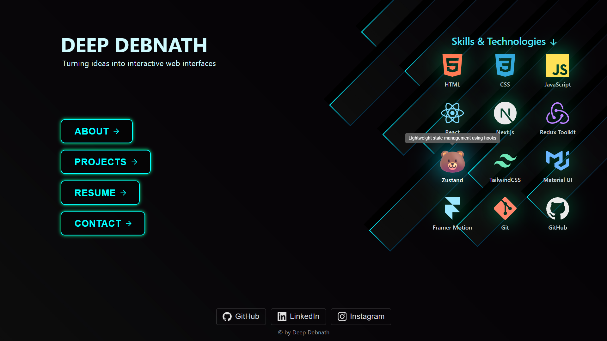
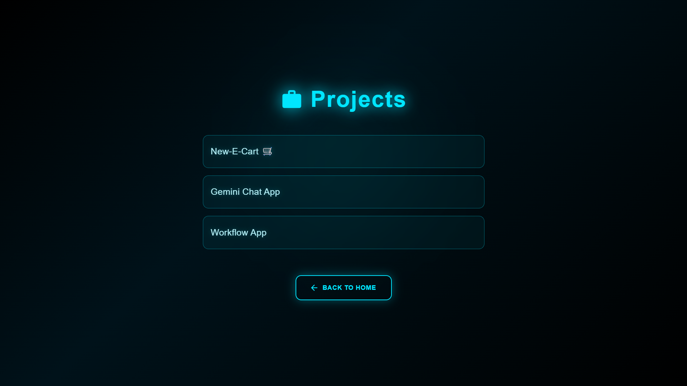

# 🌐 My Portfolio

A modern personal **Portfolio Website** built with **Next.js**, **TailwindCSS**, **Mui**, and **Framer Motion** to showcase my skills, projects, and professional background as a **Frontend Developer**.

---

## 🚀 Live Demo

🔗 **[View Portfolio](https://my-portfolio-ob9g.vercel.app/)**

---

## 🧠 About the Project

This portfolio is designed to reflect my frontend development skills and projects with a clean and interactive interface.  
It includes all my recent work, social links, and a downloadable resume.

### ✨ Features

- ⚡ Built using **Next.js (App Router)** for fast and SEO-optimized pages
- 🎨 Styled with **Tailwind CSS**
- 🎥 Smooth animations using **Framer Motion**
- 🧱 Modular and clean component structure
- 📱 Fully **responsive** design
- 🧾 Resume download section
- 💬 Contact form with validation
- 💻 Project showcase section with live links and GitHub links

---

## 🏗️ Tech Stack

| Category            | Technologies  |
| ------------------- | ------------- |
| **Framework**       | Next.js       |
| **Styling**         | TailwindCSS   |
| **Animation**       | Framer Motion |
| **Library**         | Material Ui   |
| **Deployment**      | Vercel        |
| **Version Control** | Git + GitHub  |

---

## ⚙️ Setup and Run Locally

```bash
# Clone the repository
git clone https://github.com/Deep-Debnath/my-portfolio.git

# Navigate to the app directory
cd my-app

# Install dependencies
npm install

# Run the development server
npm run dev
```

Open http://localhost:3000 in your browser.

---

## 📸 Screenshots




---

## 🧑‍💻 Author

**Deep Debnath**  
Frontend Developer • React / Next.js / UI / AI Integration

🌐 [Portfolio](https://my-portfolio-ob9g.vercel.app/)  
💼 [GitHub](https://github.com/Deep-Debnath)

---
